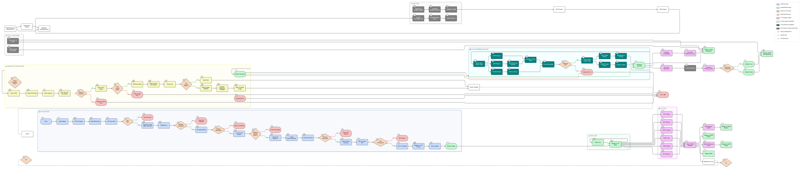

# 🦕 Few-Shot Object Recognition on ESP32-S3

> **Embedded few-shot object recognition system** using a MobileNetV2 embedding model deployed on an ESP32-S3 microcontroller with a live web dashboard.

The system captures images via an ArduCAM camera, extracts 128-dimensional embedding vectors using an INT8-quantized neural network, and compares them using cosine similarity — all running on-device in real time.

---

## 📑 Table of Contents

- [Overview](#-overview)
- [System Architecture](#-system-architecture)
- [Hardware](#-hardware)
- [Model Details](#-model-details)
- [Performance Summary](#-performance-summary)
- [Project Structure](#-project-structure)
- [Setup & Installation](#-setup--installation)
- [Usage](#-usage)
  - [Training the Model](#1-training-the-model)
  - [Converting to TFLite](#2-converting-to-tflite)
  - [Generating the C Header](#3-generating-the-c-header)
  - [Flashing the ESP32](#4-flashing-the-esp32)
  - [Running the Dashboard](#5-running-the-dashboard)
  - [PC Inference (Optional)](#6-pc-inference-optional)
- [Analysis & Visualization Scripts](#-analysis--visualization-scripts)
- [API Reference](#-api-reference)
- [Output Gallery](#-output-gallery)
  - [Training Results](#training-results)
  - [Quantization & Conversion](#quantization--conversion-analysis)
  - [Model Comparison (Keras vs INT8)](#model-comparison-keras-vs-int8)
  - [Feature Map Visualization](#feature-map-visualization)
- [Dependencies](#-dependencies)
- [Author & Contributors](#-author--contributors)
- [Acknowledgements](#-acknowledgements)
- [License](#-license)

---

## 🔍 Overview

**Problem:** Traditional object detection models are too large for microcontrollers and require pre-defined classes.

**Solution:** A **few-shot learning** approach where:
1. The user shows 2–3 reference images of any object to the ESP32 camera
2. The device extracts a compact 128-dimensional embedding (feature vector)
3. When a new object is presented, its embedding is compared against the references
4. If the cosine similarity exceeds a threshold (default: 0.75), it is a **match**

This means the system can recognize **any object** — even the ones it was never trained on — using just a few reference photos captured at runtime.

---

## 🏗 System Architecture

```
┌─────────────────────────────────────────────────────────────────┐
│                        Web Dashboard                            │
│                  (Next.js, runs on laptop)                      │
│    ┌──────────┐  ┌──────────┐  ┌──────────┐  ┌──────────────┐   │
│    │ Capture  │  │   Test   │  │  Reset   │  │   Metrics    │   │
│    │ Reference│  │  Object  │  │          │  │  Dashboard   │   │
│    └────┬─────┘  └────┬─────┘  └────┬─────┘  └───────┬──────┘   │
└─────────┼─────────────┼─────────────┼────────────────┼──────────┘
          │ HTTP POST   │ HTTP POST   │ HTTP POST      │ HTTP GET
          ▼             ▼             ▼                ▼
┌─────────────────────────────────────────────────────────────────┐
│                     ESP32-S3 Firmware                           │
│                                                                 │
│  ┌──────────┐   ┌───────────┐   ┌──────────┐   ┌────────────┐   │
│  │ ArduCAM  │──▶│  Crop &   │──▶│ TFLite   │──▶│  Cosine   │   │
│  │ Capture  │   │ RGB565→   │   │ Micro    │   │ Similarity │   │
│  │ 160×120  │   │ RGB888    │   │ Inference│   │ Comparison │   │
│  │          │   │ 96×96     │   │ → 128-d  │   │            │   │
│  └──────────┘   └───────────┘   └──────────┘   └────────────┘   │
│                                                                 │
│  Model: MobileNetV2 α=0.35, INT8 Quantized (~772 KB)            │
│  Memory: 2 MB Tensor Arena in PSRAM                             │
└─────────────────────────────────────────────────────────────────┘
```

### Detailed System Flowchart

The following flowchart details the exact execution pipeline running on the ESP32-S3, from hardware initialization and HTTP request handling to the camera capture and TFLite inference loops:



---

## 🔧 Hardware

| Component | Specification |
|-----------|--------------|
| **Board** | Arduino® Nano ESP32 |
| **Wi-Fi Module** | u-blox NORA-W106 (ESP32-S3 based) |
| **Processor** | Xtensa® Dual-Core 32-bit LX7 Microprocessor, up to 240 MHz |
| **ROM** | 384 KB |
| **SRAM** | 512 KB |
| **PSRAM** | 8 MB (used for tensor arena + image buffers) |
| **Flash** | 16 MB (QSPI, 133 MHz) |
| **Camera** | ArduCAM Mini 2MP OV2640 (SPI + I2C) |
| **Camera Sensor** | OV2640 CMOS, 2 MP (max 1600×1200) |
| **Capture Resolution** | 160×120 RGB565, center-cropped to 96×96 RGB888 |
| **Camera Frame Buffer** | 8 MB on-module |
| **Camera Output Formats** | JPEG, RGB565/555, YUV422, Raw RGB |
| **Communication** | Wi-Fi 802.11 b/g/n (STA mode) |
| **Power** | USB-C, 5V |
| **Camera Dimensions** | 35 × 25 mm |

### Pin Configuration

| Signal | ESP32-S3 Pin |
|--------|-------------|
| SPI SCK | GPIO 13 |
| SPI MISO | GPIO 11 |
| SPI MOSI | GPIO 12 |
| Camera CS | GPIO 10 |
| I2C SDA/SCL | Default Wire pins |

---

## 🧠 Model Details

### Architecture

| Parameter | Value |
|-----------|-------|
| **Backbone** | MobileNetV2 (ImageNet pre-trained) |
| **Width Multiplier (α)** | 0.35 (smallest variant, optimized for MCU) |
| **Input Size** | 96 × 96 × 3 (RGB) |
| **Embedding Dimension** | 128 |
| **Output Normalization** | L2-normalized (unit hypersphere) |
| **Quantization** | Full INT8 (weights + activations) |
| **Training Strategy** | Two-phase: frozen backbone → fine-tuning last 30 layers |

### Training Data

10 object classes, ~48 images per class (482 total):

| Class | Examples |
|-------|----------|
| `bottle` `charger` `key` `mouse` `mug` | Everyday objects |
| `notebook` `pen` `phone` `remote` `wallet` | Everyday objects |

### Model Files (in `models/`)

| File | Size | Purpose |
|------|------|---------|
| `best_training_model.h5` | 7.0 MB | Full training model (classification head + embedding) |
| `embedding_model.keras` | 2.8 MB | Embedding-only model (Keras format) |
| `embedding_model_float32.tflite` | 697 KB | TFLite float32 (for PC inference/debugging) |
| `embedding_model_int8_esp32.tflite` | 772 KB | TFLite INT8 quantized (deployed to ESP32) |
| `config.json` | — | Model configuration (image size, alpha, classes) |
| `class_names.json` | — | Class name mapping |

### How the Model is Stored on ESP32

The INT8 TFLite model is converted to a **C header file** (`embedding_model_int8_esp32_model.h`) containing the model weights as a `const unsigned char[]` array. This array is stored in the ESP32's **Flash memory** (8 MB). At runtime:

1. The model bytes are loaded from Flash into the TFLite Micro interpreter
2. A **2 MB tensor arena** is allocated in **PSRAM** for intermediate activations
3. Input tensor (96×96×3 = 27,648 bytes) and output tensor (128 × int8) reside in the arena
4. Inference runs entirely on the ESP32's CPU (no external accelerator)

---

## 📊 Performance Summary

### Training Results

| Metric | Value |
|--------|-------|
| Validation Accuracy | **91.75%** |
| Macro F1-Score | 0.918 |
| Macro Precision | 0.930 |
| Macro Recall | 0.925 |
| Macro AUC (ROC) | **0.998** |
| Silhouette Score | 0.628 |
| Training Time | ~111 seconds (50 epochs total) |

### Quantization Impact (Keras Float32 → INT8)

| Metric | Keras (Float32) | INT8 Quantized | Delta |
|--------|----------------|----------------|-------|
| Model Size | 2,819 KB | 772 KB | **3.65× smaller** |
| Accuracy | 96.27% | 92.95% | −3.32% |
| Macro F1 | 0.962 | 0.928 | −0.034 |
| Embedding Fidelity (cosine sim) | — | 0.931 | — |
| Inference Latency (PC) | 68.4 ms | 0.77 ms | **88× faster** |

---

## 📁 Project Structure

```
Dino/
│
├── Code/                              # Python scripts (training, inference, analysis)
│   ├── train_fewshot_embeddings.py    #   Train the MobileNetV2 embedding model
│   ├── convert_to_tflite.py          #   Convert Keras → TFLite (Float32 + INT8)
│   ├── inference_h5.py               #   PC inference using Keras .h5/.keras model
│   ├── inference_tflite.py           #   PC inference using TFLite model
│   ├── compare_models.py            #   Keras vs INT8 comparison (plots + metrics)
│   └── visualize_layers.py          #   CNN feature map visualization
│
├── convto_h/                          # TFLite → C header converter
│   ├── tflm_converter.py            #   Converts .tflite to Arduino .h header file
│   └── micro_mutable_op_resolver.h  #   TFLM operator reference for validation
│
├── data/                              # Training dataset (10 classes)
│   ├── bottle/
│   ├── charger/
│   ├── key/
│   ├── mouse/
│   ├── mug/
│   ├── notebook/
│   ├── pen/
│   ├── phone/
│   ├── remote/
│   └── wallet/
│
├── models/                            # Trained model files
│   ├── best_training_model.h5        #   Full training model
│   ├── embedding_model.keras         #   Embedding model (Keras native)
│   ├── embedding_model_float32.tflite#   TFLite Float32
│   ├── embedding_model_int8_esp32.tflite  # TFLite INT8 (for ESP32)
│   ├── config.json                   #   Model configuration
│   └── class_names.json              #   Class label mapping
│
├── object_recognition_web/            # ESP32-S3 Arduino firmware
│   ├── object_recognition_web.ino    #   Main firmware (capture → infer → serve API)
│   └── embedding_model_int8_esp32_model.h  # Model weights as C array
│
├── website/                           # Next.js web dashboard
│   ├── app/
│   │   ├── page.js                   #   Main dashboard page (React)
│   │   ├── globals.css               #   Styles
│   │   ├── layout.js                 #   App layout
│   │   └── components/
│   │       ├── flow-field-background.js   # Animated background
│   │       ├── glowing-effect.js          # Glow animation
│   │       └── snappy-slider.js           # Threshold slider
│   ├── package.json
│   └── ...
│
├── details/                           # Generated analysis outputs (plots + metrics)
│   ├── README.md                     #   In-depth model analysis (architecture, quantization, feature maps)
│   ├── traning/                      #   Training evaluation (17 files)
│   ├── conversion/                   #   Quantization analysis (10 files)
│   ├── comparison/                   #   Keras vs INT8 comparison (14 files)
│   └── feature_maps/                 #   CNN layer visualizations (17 files)
│
├── test_images/                       # Sample test images for inference scripts
│
├── Asset/                             # Project assets
│   ├── Flowchart.png                 #   Detailed system execution flowchart
│   ├── embedding_model.png           #   High-level embedding model architecture diagram
│   ├── embedding_model_d.png         #   Detailed layer-by-layer embedding model diagram
│   └── embedding_model_int8_esp32.png#   TFLite INT8 quantized model architecture
│
├── component_used/                    # Hardware datasheets
│   ├── esp32 s3 datasheet.pdf        #   Arduino Nano ESP32 (ESP32-S3) datasheet
│   └── camera.pdf                    #   ArduCAM OV2640 camera module datasheet
│
├── requirements.txt                   # Python dependencies
└── README.md                          # This file
```

---

## 🚀 Setup & Installation

### Prerequisites

- **Python** 3.9 – 3.11 (for training and conversion scripts)
- **Node.js** 18+ (for the web dashboard)
- **Arduino IDE** 2.x with ESP32-S3 board support (for firmware flashing)
- **ArduCAM** library installed in Arduino IDE

### Python Environment

```bash
# Create and activate a virtual environment
python -m venv .venv
.venv\Scripts\activate        # Windows
# source .venv/bin/activate   # macOS/Linux

# Install dependencies
pip install -r requirements.txt
```

### Web Dashboard

```bash
cd website
npm install
```

---

## 💻 Usage

### 1. Training the Model

```bash
cd Code
python train_fewshot_embeddings.py
```

This will:
- Load images from `data/` (10 classes)
- Train a MobileNetV2-based embedding model in two phases
- Save the trained model to `models/`
- Generate training evaluation plots in `details/traning/`

### 2. Converting to TFLite

```bash
python convert_to_tflite.py
```

This will:
- Convert the Keras model to Float32 TFLite (for PC testing)
- Convert to INT8 quantized TFLite (for ESP32 deployment)
- Generate quantization analysis plots in `details/conversion/`

### 3. Generating the C Header

```bash
cd ../convto_h
python tflm_converter.py
```

This converts `embedding_model_int8_esp32.tflite` into a C header file (`embedding_model_int8_esp32_model.h`) that can be compiled directly into the Arduino firmware.

### 4. Flashing the ESP32

1. Open `object_recognition_web/object_recognition_web.ino` in Arduino IDE
2. Select board: **Arduino Nano ESP32**
3. Update Wi-Fi credentials in the file (lines 64–65)
4. Upload to the ESP32-S3
5. Open Serial Monitor (921600 baud) to see the device IP address

### 5. Running the Dashboard

```bash
cd website
npm run dev
```

- Open `http://localhost:3000` in your browser
- Enter the ESP32 IP address shown in the Serial Monitor
- Use the dashboard to:
  - **Capture** up to 3 reference images of an object
  - **Test** new objects against the references
  - **Monitor** real-time system metrics (memory, latency, Wi-Fi, etc.)

### 6. PC Inference (Optional)

Run inference locally without the ESP32:

```bash
# Using the Keras model
python Code/inference_h5.py --reference img1.jpg img2.jpg img3.jpg --query test.jpg

# Using the TFLite INT8 model (simulates ESP32 behavior)
python Code/inference_tflite.py --int8 --reference img1.jpg img2.jpg img3.jpg --query test.jpg

# Interactive mode (type image paths or use webcam)
python Code/inference_tflite.py --webcam
```

---

## 📈 Analysis & Visualization Scripts

| Script | Output Directory | Description |
|--------|-----------------|-------------|
| `train_fewshot_embeddings.py` | `details/traning/` | Training curves, confusion matrices, ROC, t-SNE, PCA, class metrics |
| `convert_to_tflite.py` | `details/conversion/` | Model size comparison, weight distribution, quantization error, ESP32 memory budget |
| `compare_models.py` | `details/comparison/` | Side-by-side Keras vs INT8: accuracy, confusion matrices, t-SNE, latency |
| `visualize_layers.py` | `details/feature_maps/` | Per-layer CNN feature maps, activation magnitudes, multi-class comparison |

---

## 🌐 API Reference

All endpoints return JSON. The ESP32 runs an HTTP server on port 80.

| Method | Endpoint | Description |
|--------|----------|-------------|
| `GET` | `/` | API info and available endpoints |
| `GET` | `/status` | Current reference count |
| `GET` | `/metrics` | System diagnostics (heap, PSRAM, RSSI, latency, uptime) |
| `POST` | `/capture` | Capture a reference image, returns embedding + Base64 image |
| `POST` | `/test` | Capture test image, compare against references, returns similarity |
| `POST` | `/reset` | Clear all stored references and reset counters |

### Example Response — `/test`

```json
{
  "success": true,
  "similarity": 0.8923,
  "max_similarity": 0.9145,
  "min_similarity": 0.8701,
  "match": true,
  "threshold": 0.75,
  "capture_ms": 320,
  "inference_ms": 1850,
  "total_ms": 2170,
  "image": "<base64-encoded RGB888 data>",
  "embedding": [0.0312, -0.0567, ...],
  "ref_embeddings": [[...], [...], [...]]
}
```

---

## 🖼 Output Gallery

> [!TIP]
> For an **in-depth technical analysis** — including MobileNetV2 architecture explanation, training strategy, quantization process, and annotated feature map visualizations — see the dedicated **[Model Analysis README](details/README.md)**.

### Training Results

Generated by `train_fewshot_embeddings.py` → saved in `details/traning/`

| Plot | Description |
|------|-------------|
| `training_history_accuracy.png` | Training & validation accuracy over 50 epochs (Phase 1 → Phase 2) |
| `training_history_loss.png` | Training & validation loss curves |
| `confusion_matrix.png` | Normalized confusion matrix on validation set |
| `confusion_matrix_raw.png` | Raw count confusion matrix |
| `classification_report.png` | Per-class precision, recall, F1-score table |
| `per_class_metrics.png` | Grouped bar chart: precision/recall/F1 per class |
| `roc_curves.png` | One-vs-Rest ROC curves with AUC for each class |
| `dataset_distribution.png` | Train/validation split distribution per class |
| `tsne_embeddings.png` | t-SNE 2D visualization of the embedding space |
| `pca_embeddings_2d.png` | PCA 2D projection of embeddings |
| `pca_embeddings_3d.png` | PCA 3D projection of embeddings |
| `cosine_similarity_heatmap.png` | Cosine similarity between class centroids |
| `intra_inter_class_distances.png` | Distribution of intra-class vs inter-class distances |
| `embedding_spread.png` | Per-class embedding compactness (spread from centroid) |

### Quantization & Conversion Analysis

Generated by `convert_to_tflite.py` → saved in `details/conversion/`

| Plot | Description |
|------|-------------|
| `model_size_comparison.png` | Bar chart: Keras (2.8 MB) vs Float32 TFLite (681 KB) vs INT8 (772 KB) |
| `embedding_fidelity.png` | Histogram of cosine similarity between Float32 & INT8 embeddings |
| `quantization_accuracy_impact.png` | Accuracy & F1 comparison: Float32 vs INT8 |
| `weight_distribution.png` | Float32 weight histogram vs INT8 quantized weight histogram |
| `quantization_error_heatmap.png` | Per-dimension error heatmap (Float32 vs INT8 embeddings) |
| `operator_distribution.png` | Pie + bar chart of TFLite operator types (CONV_2D, DEPTHWISE, etc.) |
| `layer_analysis.png` | Memory usage breakdown by layer type |
| `esp32_memory_budget.png` | ESP32-S3 Flash/SRAM utilization table and chart |
| `inference_latency.png` | Boxplot + bar chart of Float32 vs INT8 inference latency |

### Model Comparison (Keras vs INT8)

Generated by `compare_models.py` → saved in `details/comparison/`

| Plot | Description |
|------|-------------|
| `comparison_summary_table.png` | Comprehensive summary table: size, accuracy, F1, latency, silhouette |
| `model_size_comparison.png` | Keras vs INT8 model size |
| `accuracy_comparison.png` | Overall + per-class accuracy comparison |
| `per_class_f1_comparison.png` | Per-class F1-score: Keras vs INT8 |
| `confusion_matrices_comparison.png` | Side-by-side confusion matrices |
| `embedding_fidelity.png` | Cosine similarity distribution between model outputs |
| `tsne_comparison.png` | t-SNE visualizations side-by-side |
| `pca_comparison.png` | PCA projections side-by-side |
| `cosine_similarity_comparison.png` | Centroid similarity heatmaps for both models |
| `intra_inter_distance_comparison.png` | Intra vs inter-class distance histograms |
| `embedding_spread_comparison.png` | Per-class embedding compactness comparison |
| `quantization_error_heatmap.png` | Per-sample, per-dimension quantization error |
| `latency_comparison.png` | Inference speed: Keras (~68 ms) vs INT8 (~0.8 ms) → 88× faster |

### Feature Map Visualization

Generated by `visualize_layers.py` → saved in `details/feature_maps/`

| Plot | Description |
|------|-------------|
| `input_image.png` | The input image fed to the model |
| `layer_00_Conv1_relu.png` – `layer_11_out_relu.png` | Feature maps at 12 key layers of MobileNetV2 |
| `layer_progression_overview.png` | All layers in one figure showing feature evolution |
| `activation_magnitude.png` | Mean activation magnitude and channel count per layer |
| `top_activations_grid.png` | Strongest feature map at each layer |
| `multi_class_feature_comparison.png` | Same layer's response across different object classes |

---

## 📦 Dependencies

### Python (`requirements.txt`)

| Package | Version | Purpose |
|---------|---------|---------|
| `tensorflow` | ≥2.13, <2.18 | Model training, TFLite conversion |
| `numpy` | ≥1.24, <2.0 | Numerical operations |
| `Pillow` | ≥9.0 | Image loading and preprocessing |
| `scikit-learn` | ≥1.3 | Metrics (confusion matrix, ROC, t-SNE, PCA) |
| `matplotlib` | ≥3.7 | Plot generation |
| `seaborn` | ≥0.12 | Enhanced statistical plots |
| `opencv-python` | ≥4.8 | Webcam support (optional) |
| `tqdm` | ≥4.65 | Progress bars |

### Web Dashboard

| Package | Purpose |
|---------|---------|
| `next` | React framework |
| `react` / `react-dom` | UI library |

### Arduino Libraries

| Library | Purpose |
|---------|---------|
| ArduCAM | OV2640 camera driver |
| [TFLiteMicro_ArduinoESP32S3](https://github.com/j-siderius/TFLiteMicro_ArduinoESP32S3) | TensorFlow Lite Micro runtime for ESP32-S3 |
| WebServer | HTTP server |
| WiFi | Wi-Fi connectivity |

---

## 👤 Author & Contributors

**Author** : [Harsh Patel](https://github.com/Codewithharsh1326)

**Contributors** : [Harshil Kanani](https://github.com/49-51)

---

## 🙏 Acknowledgements

- **[TFLiteMicro_ArduinoESP32S3](https://github.com/j-siderius/TFLiteMicro_ArduinoESP32S3)** by [j-siderius](https://github.com/j-siderius/) — A plug-and-play TensorFlow Lite Micro library for the ESP32-S3 platform. This library made it possible to run INT8 quantized neural network inference directly on the microcontroller without needing to build TFLite Micro from source. It also provides the `tflm_converter.py` tool (used in `convto_h/`) to convert TFLite models into C-compatible header files with an auto-generated Micro Mutable Op Resolver.

- **[ArduCAM](https://www.arducam.com/)** — For the OV2640 camera module and the accompanying Arduino library.

- **[TensorFlow Lite for Microcontrollers](https://www.tensorflow.org/lite/microcontrollers)** — Google's framework for deploying ML models on embedded devices.

---

## 📄 License

This project was developed as part of an academic assignment at Nirma University.

---

<p align="center">
  Made with ❤️ on ESP32-S3
</p>
