# 📊 Model Analysis & Results

> Comprehensive analysis of the MobileNetV2 (α=0.35) embedding model — architecture, training, quantization, and visual explanations of what the model sees.

---

## 📑 Table of Contents

- [MobileNetV2 Architecture](#-mobilenetv2-architecture)
  - [Why MobileNetV2?](#why-mobilenetv2)
  - [Width Multiplier α=0.35](#width-multiplier-α035)
  - [Our Model Architecture](#our-model-architecture)
- [Training Strategy](#-training-strategy)
  - [Hyperparameters](#hyperparameters)
  - [Two-Phase Training](#two-phase-training)
  - [Loss Function & Optimizer](#loss-function--optimizer)
  - [Training Results](#training-results)
- [Embedding Space Analysis](#-embedding-space-analysis)
- [Quantization (Float32 → INT8)](#-quantization-float32--int8)
  - [Why INT8 Quantization?](#why-int8-quantization)
  - [Quantization Process](#quantization-process)
  - [Quantized Model Architecture](#quantized-model-architecture)
  - [Impact on Model Size](#impact-on-model-size)
  - [Impact on Accuracy](#impact-on-accuracy)
  - [Embedding Fidelity](#embedding-fidelity)
  - [Weight Distribution Changes](#weight-distribution-changes)
  - [Operator Analysis](#operator-analysis)
  - [ESP32 Memory Budget](#esp32-memory-budget)
- [Keras vs INT8 — Full Comparison](#-keras-vs-int8--full-comparison)
- [What the Model Sees — Feature Map Visualization](#-what-the-model-sees--feature-map-visualization)
  - [Layer-by-Layer Progression](#layer-by-layer-progression)
  - [Activation Analysis](#activation-analysis)
  - [Multi-Class Feature Comparison](#multi-class-feature-comparison)

---

## 🧠 MobileNetV2 Architecture

### Why MobileNetV2?

MobileNetV2 is a convolutional neural network architecture specifically designed for **mobile and embedded devices**. It introduces two key innovations:

1. **Depthwise Separable Convolutions** — Instead of a standard convolution (which is computationally expensive), MobileNetV2 splits it into:
   - A *depthwise convolution* (applies a single filter per input channel)
   - A *pointwise convolution* (1×1 conv to combine channels)
   - This reduces computation by **8–9×** compared to standard convolutions.

2. **Inverted Residual Blocks** — Unlike traditional residual networks (wide → narrow → wide), MobileNetV2 uses **narrow → wide → narrow** blocks:
   - *Expand*: 1×1 conv increases channels (expansion factor, typically 6×)
   - *Depthwise*: 3×3 depthwise conv processes spatial features
   - *Project*: 1×1 conv compresses back to a smaller number of channels
   - *Residual connection*: Shortcuts connect the narrow layers (bottlenecks)

```
Standard Residual Block        Inverted Residual Block (MobileNetV2)
┌─────────────┐                ┌─────────────┐
│ Wide (256)  │                │ Narrow (24) │  ← bottleneck
├─────────────┤                ├─────────────┤
│ Narrow (64) │                │ Wide (144)  │  ← expanded (6×)
├─────────────┤                ├─────────────┤
│ Wide (256)  │                │ Narrow (24) │  ← bottleneck
└──────┬──────┘                └───────┬─────┘
       │ residual                      │ residual
       ▼                               ▼
```

### Width Multiplier α=0.35

The **width multiplier** (α) uniformly scales the number of channels in every layer:

| α Value | Channels in Layer | Model Size | Accuracy | Use Case |
|---------|------------------|------------|----------|----------|
| 1.0 | 32 → 1280 | ~14 MB | Highest | Mobile phones |
| 0.75 | 24 → 960 | ~8 MB | High | Tablets |
| 0.50 | 16 → 640 | ~4 MB | Medium | IoT devices |
| **0.35** | **12 → 448** | **~2.8 MB** | Good | **Microcontrollers** |

We chose **α=0.35** because:
- It's the **smallest standard variant** of MobileNetV2
- Produces a model small enough to fit in ESP32 Flash (16 MB)
- Still retains enough capacity for learning discriminative embeddings
- The backbone has only **410,208 parameters** (vs 3.5M for α=1.0)

### Our Model Architecture

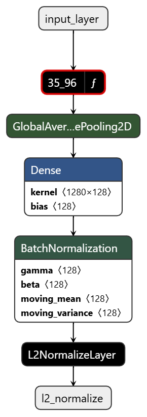

> [!NOTE]
> A much more detailed, layer-by-layer architecture diagram (with all intermediate tensor shapes) is also available at **[`Asset/embedding_model_d.png`](../Asset/embedding_model_d.png)**. It is not displayed here due to its extreme length.

```
Input Image (96×96×3)
        │
        ▼
┌───────────────────────┐
│    MobileNetV2 α=0.35 │  ← ImageNet pre-trained backbone
│    (410,208 params)   │
│                       │
│  Conv2D → 17 Inverted │
│  Residual Blocks      │
│                       │
│  Output: 3×3×1280     │
└───────────┬───────────┘
            │
            ▼
┌───────────────────────┐
│ GlobalAveragePooling2D│  ← Spatial dims → single vector
│  3×3×1280 → 1280      │
└───────────┬───────────┘
            │
            ▼
┌───────────────────────┐
│   Dense(128)          │  ← Project to embedding space
│   (163,968 params)    │
└───────────┬───────────┘
            │
            ▼
┌───────────────────────┐
│  BatchNormalization   │  ← Stabilize embedding magnitudes
│   (512 params)        │
└───────────┬───────────┘
            │
            ▼
┌───────────────────────┐
│  L2 Normalization     │  ← Unit hypersphere projection
│  ‖embedding‖ = 1.0    │
└───────────┬───────────┘
            │
            ▼
  128-dim Embedding Vector
  (used for cosine similarity)
```

**Total: 574,688 parameters (2.19 MB in float32)**

Key design decisions:
- **GlobalAveragePooling** instead of Flatten reduces 3×3×1280 = 11,520 values to just 1,280, drastically cutting the parameter count of the Dense layer
- **L2 Normalization** ensures all embeddings lie on a unit hypersphere, making cosine similarity equivalent to a simple dot product
- **128-dim embedding** is a sweet spot — large enough for discrimination, small enough for microcontroller storage (128 × 4 bytes = 512 bytes per embedding)

---

## 🏋 Training Strategy

### Hyperparameters

| Parameter | Value | Why |
|-----------|-------|-----|
| **Input size** | 96×96 | Matches ESP32 camera crop; small enough for MCU inference |
| **Batch size** | 32 | Fits in GPU memory; large enough for stable gradients |
| **Learning rate** | 0.001 (1e-3) | Standard starting rate for Adam optimizer |
| **Embedding dimension** | 128 | Balance between discrimination power and MCU memory |
| **α (width multiplier)** | 0.35 | Smallest MobileNetV2 variant for MCU deployment |
| **Phase 1 epochs** | 30 | Train embedding head only (backbone frozen) |
| **Phase 2 epochs** | 20 | Fine-tune backbone + head together |

### Two-Phase Training

Training uses a **two-phase transfer learning** approach:

**Phase 1 — Head Training (30 epochs)**
- MobileNetV2 backbone **frozen** (pre-trained ImageNet weights locked)
- Only the embedding head (Dense + BatchNorm) is trained
- This prevents catastrophic forgetting of ImageNet features
- The model learns to project backbone features into a discriminative 128-dim space

**Phase 2 — Fine-Tuning (20 epochs)**
- Last **30 layers** of the backbone are **unfrozen**
- Both backbone and head are trained jointly with a **reduced learning rate** (1e-4)
- This adapts the backbone's high-level features to our specific object classes
- Early layers (which detect edges, textures) remain frozen — these are universal

### Loss Function & Optimizer

- **Loss**: Categorical Cross-Entropy (via the classification head during training)
  - A temporary classification head (Dense → 10 classes) is added during training
  - This forces the embeddings to be class-discriminative
  - After training, the classification head is **stripped off** — only the embedding model is deployed
- **Optimizer**: Adam (adaptive learning rate)
- **Callbacks**: EarlyStopping + ReduceLROnPlateau

### Training Results

The model converged at **epoch 37** (out of 50 maximum) with early stopping:

| Metric | Value |
|--------|-------|
| Best Validation Accuracy | **91.75%** |
| Best Training Accuracy | 99.74% |
| Macro F1-Score | 0.918 |
| Macro AUC (ROC) | **0.998** |
| Training Time | ~111 seconds |

#### Training Curves

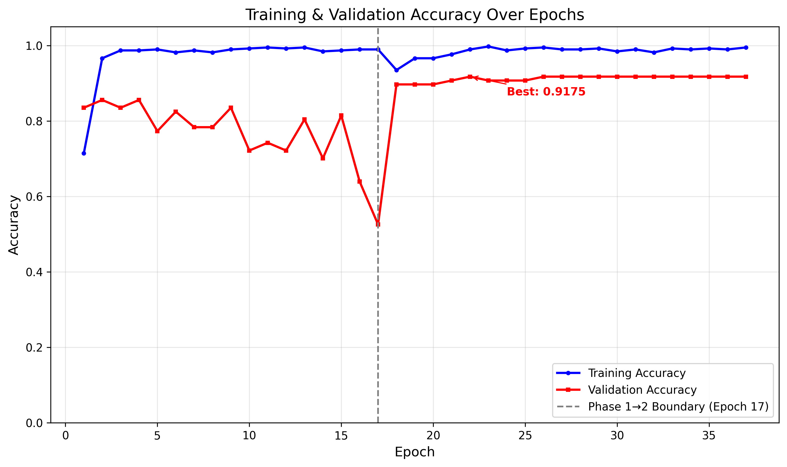

The accuracy curve clearly shows the **two-phase boundary** around epoch 30. Phase 1 achieves ~85% validation accuracy with frozen backbone. Phase 2 fine-tuning pushes it to 91.75%.

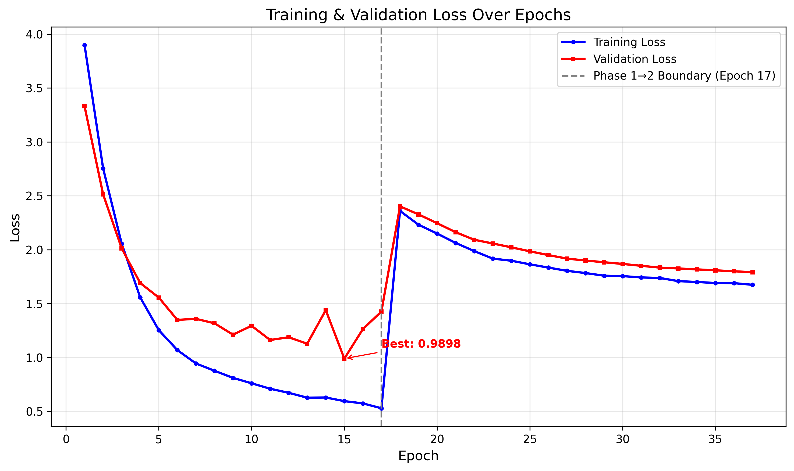

The loss curve reveals a slight gap between training and validation loss, which is expected with a small dataset (482 images). The gap is small enough to indicate the model is not severely overfitting.

#### Per-Class Performance

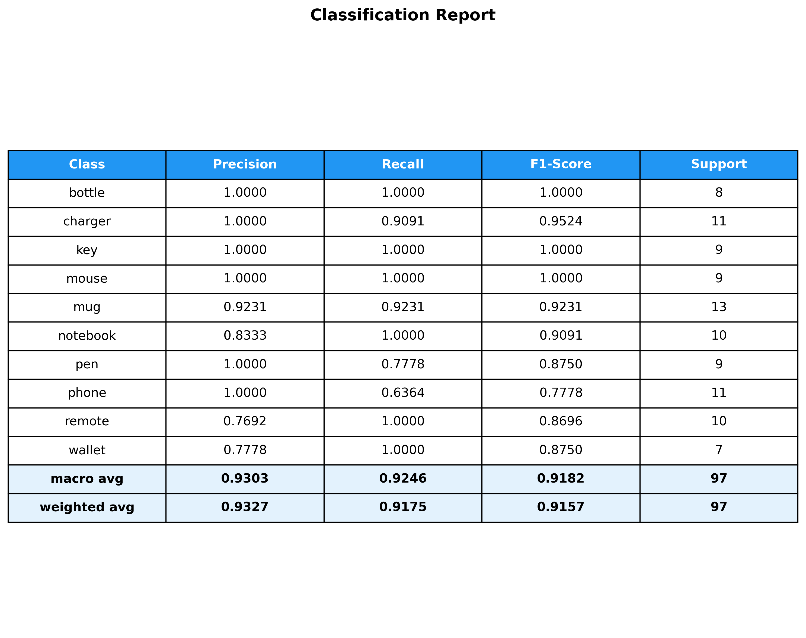

Key observations from the per-class metrics:
- **Perfect scores** (F1 = 1.0): `bottle`, `key`, `mouse` — these objects have distinctive shapes
- **Lower recall**: `phone` (63.6%) — often confused with `remote` due to similar rectangular shape
- **Lower precision**: `remote` (76.9%) — absorbs misclassified phones

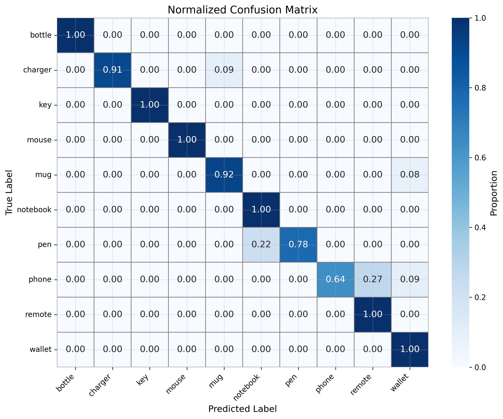

The confusion matrix confirms that the primary confusion is between `phone` ↔ `remote` and `notebook` ↔ other rectangular objects. This is expected — these objects share similar aspect ratios.

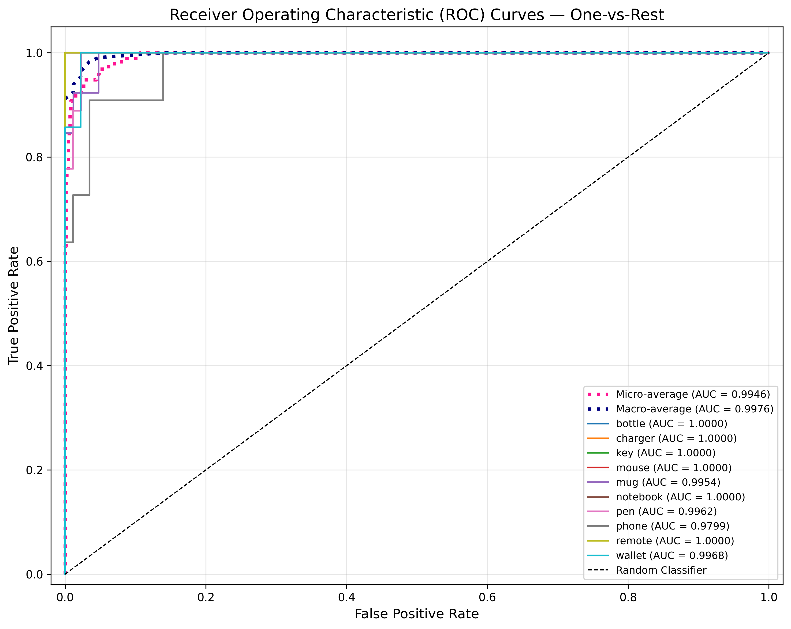

All classes achieve AUC > 0.97, with most at 1.0. This means the model has excellent separability at all threshold levels, even for the harder classes like `phone` (AUC = 0.98).

#### Dataset Distribution

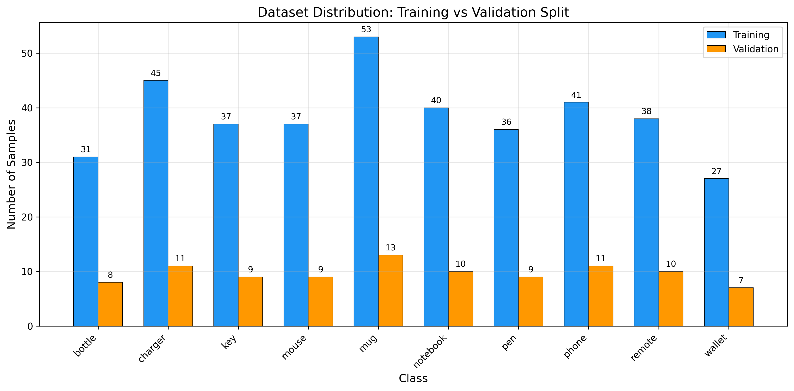

The dataset is approximately balanced, with 38–52 images per class. The 80/20 train/validation split gives 385 training and 97 validation samples.

---

## 🔮 Embedding Space Analysis

The quality of embeddings determines how well few-shot recognition works. Good embeddings should:
- **Cluster** tightly within the same class (low intra-class distance)
- **Separate** clearly between different classes (high inter-class distance)

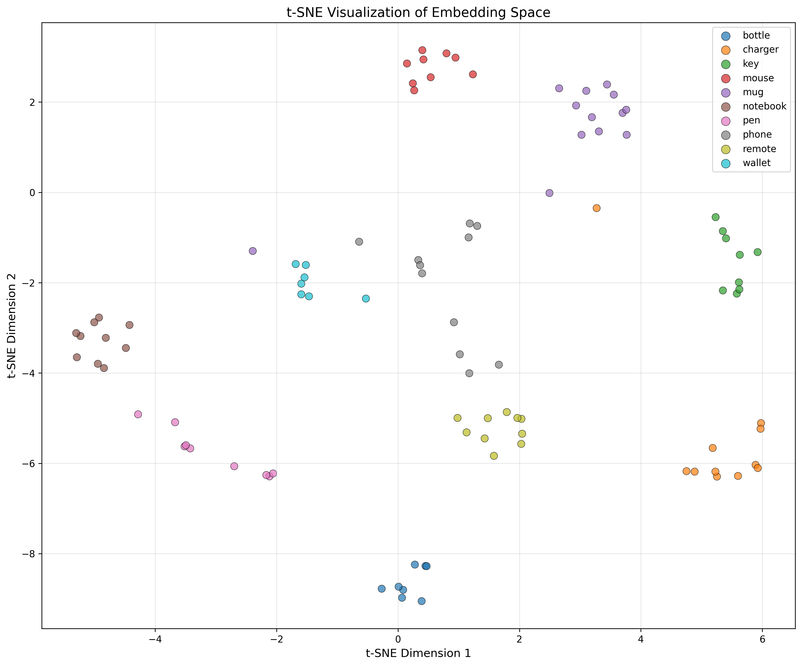

The t-SNE plot shows **10 clearly separated clusters**, one for each class. This is exactly what we want — objects of the same class map to similar embeddings, while different classes are far apart in the embedding space.

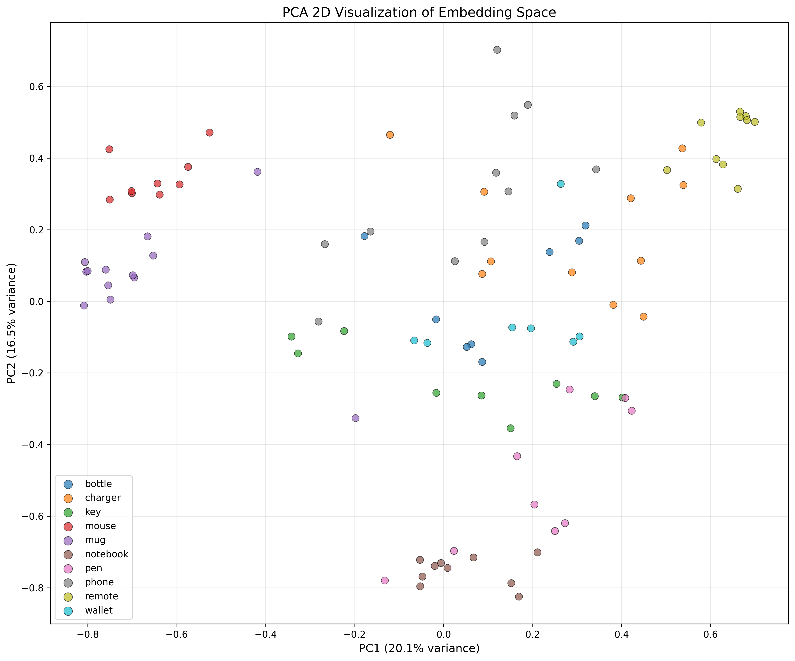

PCA (which preserves global structure better than t-SNE) confirms that the embeddings are linearly separable. The first 3 principal components explain ~49% of the variance.

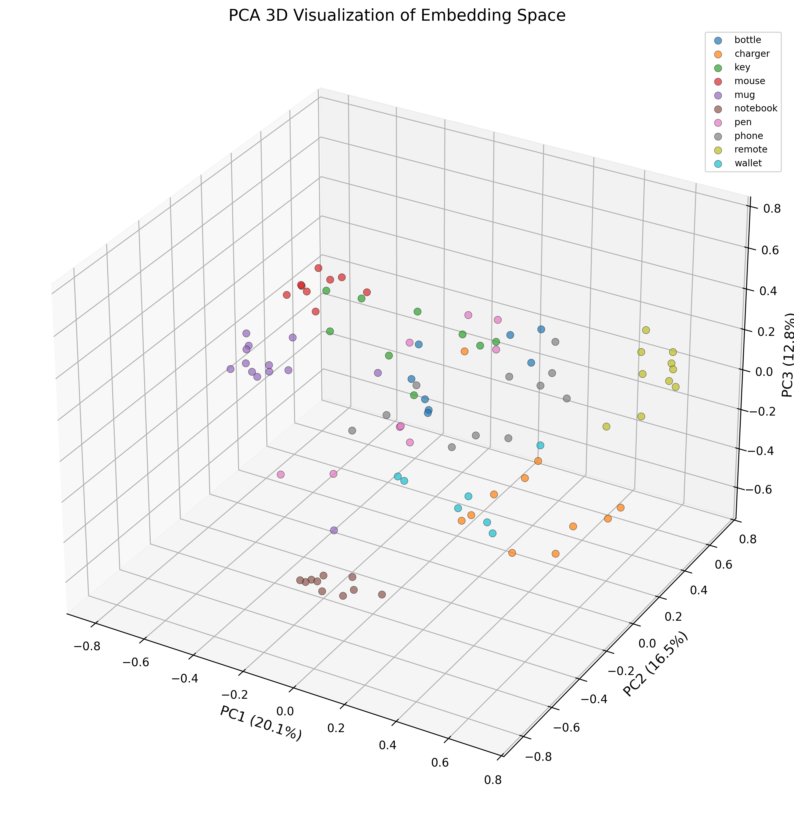

The 3D PCA view reveals the true spatial arrangement of clusters. Some classes (`bottle`, `key`, `mouse`) form very tight clusters, while others (`mug`, `notebook`) have more spread.

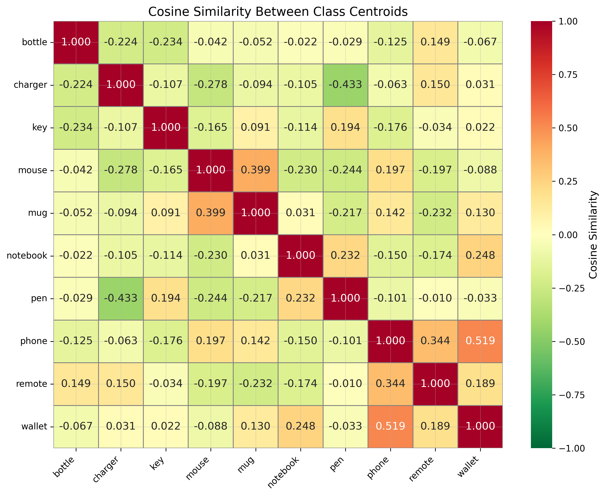

The centroid similarity heatmap shows:
- **Diagonal**: All 1.0 (each class centroid is identical to itself)
- **Off-diagonal**: Most values < 0.3, indicating good separation
- **Highest off-diagonal**: `phone` ↔ `remote` (~0.4), confirming these are the most similar classes

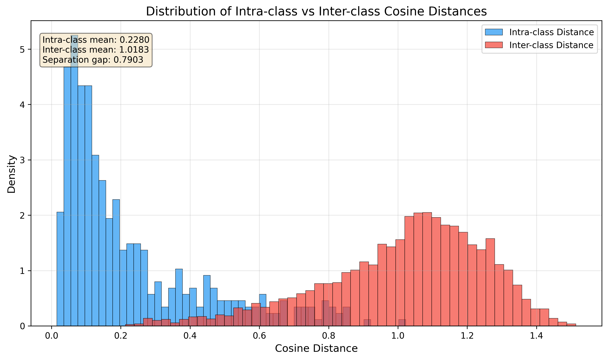

The **separation gap** between intra-class and inter-class distance distributions is **0.79**. This large gap means the model can reliably distinguish between "same object" and "different object" — the foundation of few-shot recognition.

| Metric | Value |
|--------|-------|
| Mean intra-class distance | 0.228 |
| Mean inter-class distance | 1.018 |
| Separation gap | **0.790** |
| Silhouette score | **0.628** |

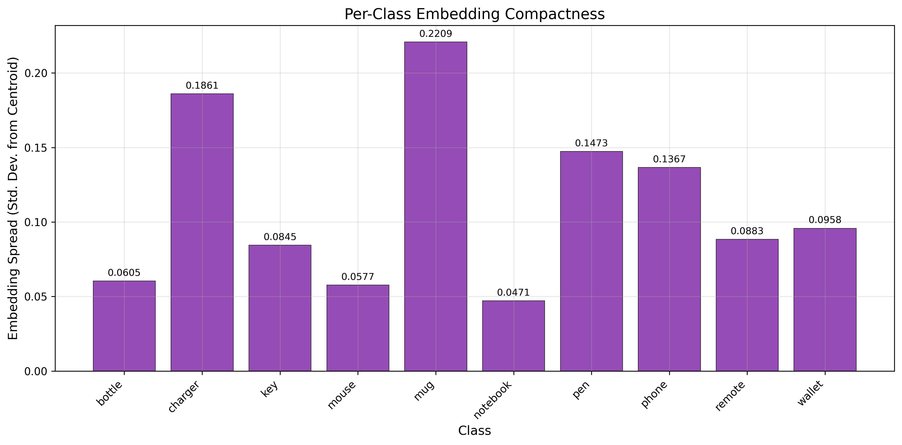

Embedding spread shows how "tight" each class cluster is:
- **Tightest**: `notebook` (0.047), `mouse` (0.058), `bottle` (0.060) — these have very consistent appearances
- **Widest**: `mug` (0.221), `charger` (0.186) — these objects have more visual variation

---

## ⚡ Quantization (Float32 → INT8)

### Why INT8 Quantization?

The ESP32-S3's CPU processes INT8 operations much faster than float32. Quantization converts all weights and activations from 32-bit floating point to 8-bit integers:

```
Float32:  3.14159265 → stored as 4 bytes (32 bits)
INT8:     3.14159265 → mapped to integer 79 (with scale=0.0398, zero_point=0)
          → stored as 1 byte (8 bits)
```

Benefits:
- **4× smaller** model (theoretically; in practice ~3.65× due to overhead)
- **Faster inference** on integer-only hardware
- **Lower power consumption** on the microcontroller

### Quantization Process

The conversion uses **post-training full integer quantization** with calibration:

1. **Calibration dataset**: A representative set of training images is fed through the model
2. **Range estimation**: For each layer, the min/max activation values are recorded
3. **Scale & zero-point**: Each tensor gets a `scale` and `zero_point` parameter that maps the float range to [-128, 127]
4. **All tensors quantized**: Both weights and activations are INT8 (not just weights) enabling pure integer inference on the ESP32

```python
# Quantization formula
int8_value = round(float_value / scale) + zero_point
float_value = (int8_value - zero_point) × scale
```

### Quantized Model Architecture


This diagram shows the final, fully-quantized model structure that runs on the ESP32. Notice how all inputs, outputs, weights, and intermediate tensors are restricted to `int8`, enabling pure integer inference using the highly-optimized XNNPACK delegate.

### Impact on Model Size

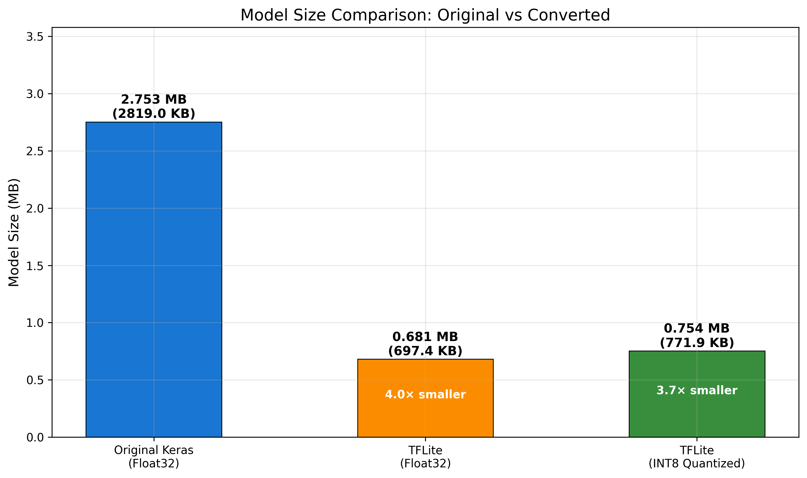

| Format | Size | Compression |
|--------|------|-------------|
| Keras (.keras) | 2,819 KB | 1.0× (baseline) |
| TFLite Float32 | 681 KB | 4.0× smaller |
| TFLite INT8 | 772 KB | 3.65× smaller |

Note: INT8 is slightly larger than Float32 TFLite because it includes additional quantization metadata (scale/zero_point for each tensor) and padding.

### Impact on Accuracy

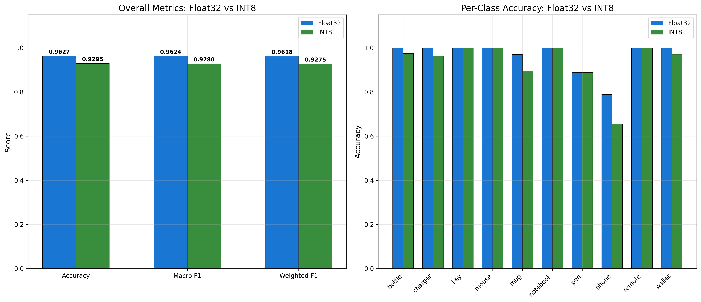

| Metric | Float32 | INT8 | Drop |
|--------|---------|------|------|
| Accuracy | 96.27% | 92.95% | −3.32% |
| Macro F1 | 0.962 | 0.928 | −0.034 |

The accuracy drop of only **3.32%** is acceptable for an embedded system. The model retains >92% accuracy despite reducing precision from 32 bits to 8 bits per value.

### Embedding Fidelity

The most critical metric for few-shot recognition is **embedding fidelity** — how similar are the INT8 embeddings to the original float32 embeddings?

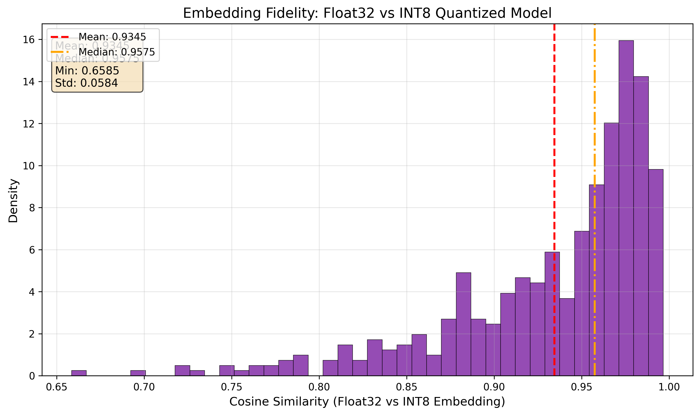

| Metric | Value |
|--------|-------|
| Mean cosine similarity | **0.935** |
| Median | 0.957 |
| Minimum | 0.658 |
| Std deviation | 0.058 |

Over 90% of images have >0.90 fidelity, meaning the INT8 model produces nearly identical embeddings to the float32 model. The few outliers (min 0.658) are edge cases that may be close to the quantization decision boundary.

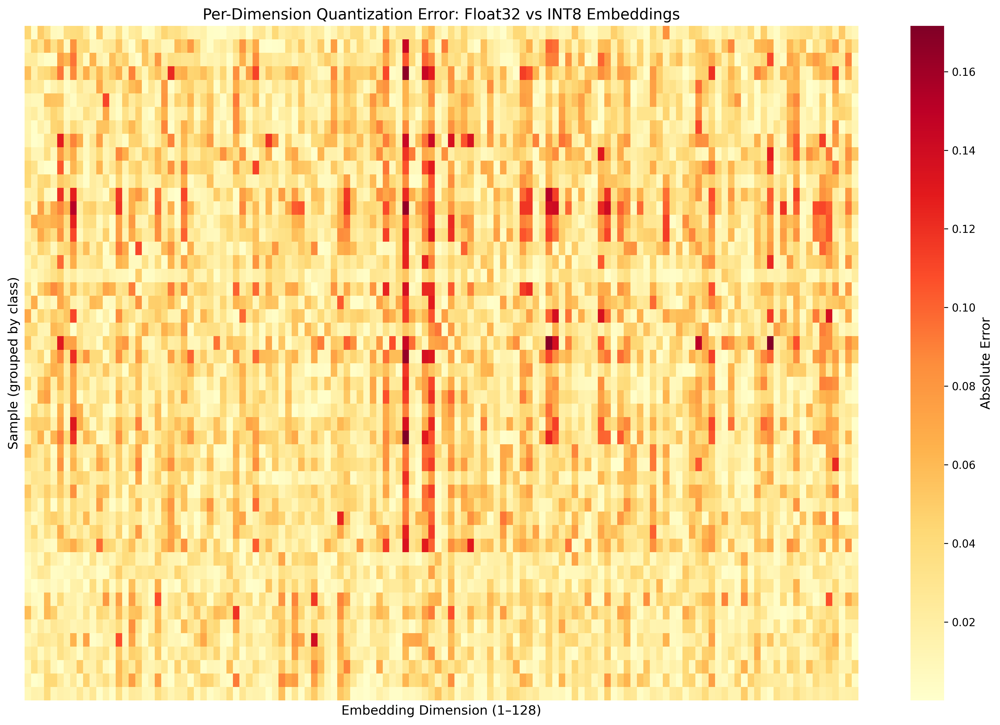

The error heatmap reveals that quantization error is **not uniform across embedding dimensions**. Some dimensions (vertical bands) consistently show higher error — these correspond to features that have small dynamic ranges, making them more sensitive to the quantization step size.

### Weight Distribution Changes

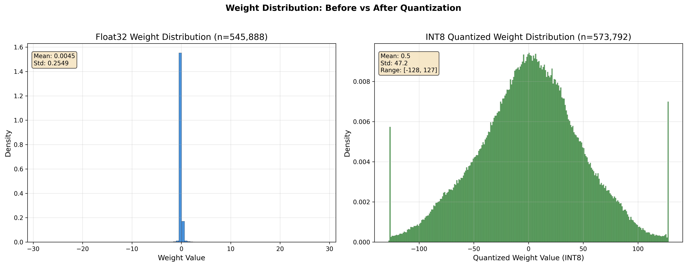

The weight distribution plot shows a key characteristic of quantization: the smooth, continuous float32 distribution is mapped onto a **discrete grid of 256 values** (INT8 range: -128 to 127). Most weights cluster near zero, which is typical for well-regularized neural networks.

### Operator Analysis

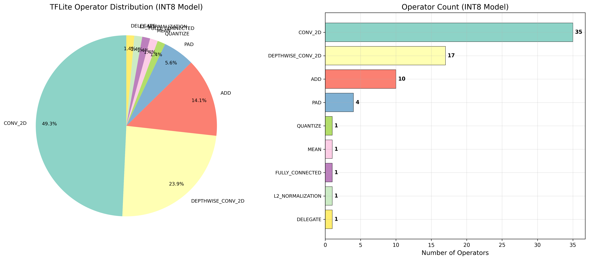

The INT8 model contains **70 operators** in total:

| Operator | Count | Purpose |
|----------|-------|---------|
| CONV_2D | 35 | Standard convolutions |
| DEPTHWISE_CONV_2D | 17 | Depthwise separable convolutions |
| ADD | 10 | Residual connections |
| PAD | 4 | Zero-padding |
| QUANTIZE | 1 | Input quantization |
| MEAN | 1 | Global average pooling |
| FULLY_CONNECTED | 1 | Dense embedding layer |
| L2_NORMALIZATION | 1 | Output normalization |

### ESP32 Memory Budget

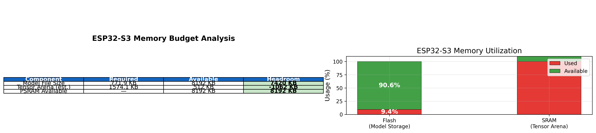

| Resource | Available | Used | Utilization |
|----------|-----------|------|-------------|
| Flash | 16 MB | 772 KB | **4.7%** |
| SRAM | 512 KB | — | Not used for model |
| PSRAM | 8 MB | ~2 MB (tensor arena) | **25%** |

The model fits comfortably in Flash (only 4.7% used). The tensor arena (2 MB) is allocated in **PSRAM** because the intermediate activations exceed the 512 KB SRAM. This is why PSRAM is essential for this project.

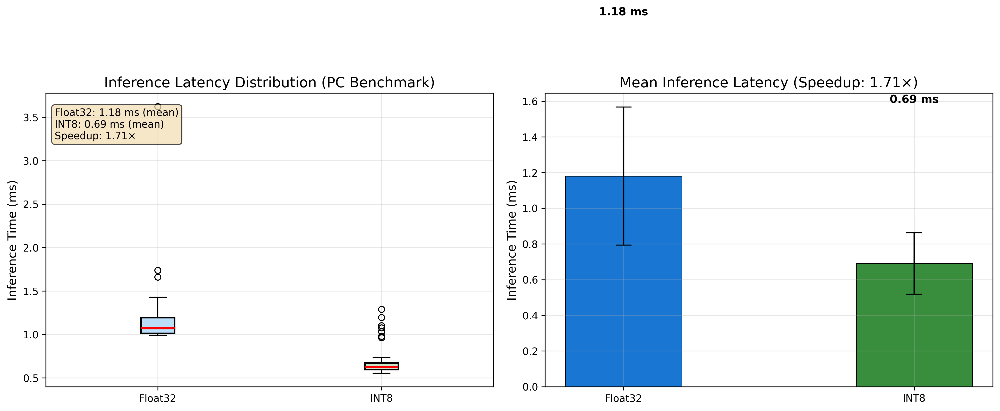

On a PC, INT8 inference is **1.7× faster** than Float32 (0.69 ms vs 1.18 ms). On the ESP32, the speedup is even greater because the CPU has optimized INT8 pathways.

---

## 🔬 Keras vs INT8 — Full Comparison

This section provides a side-by-side comparison of the original Keras model vs the deployed INT8 model.

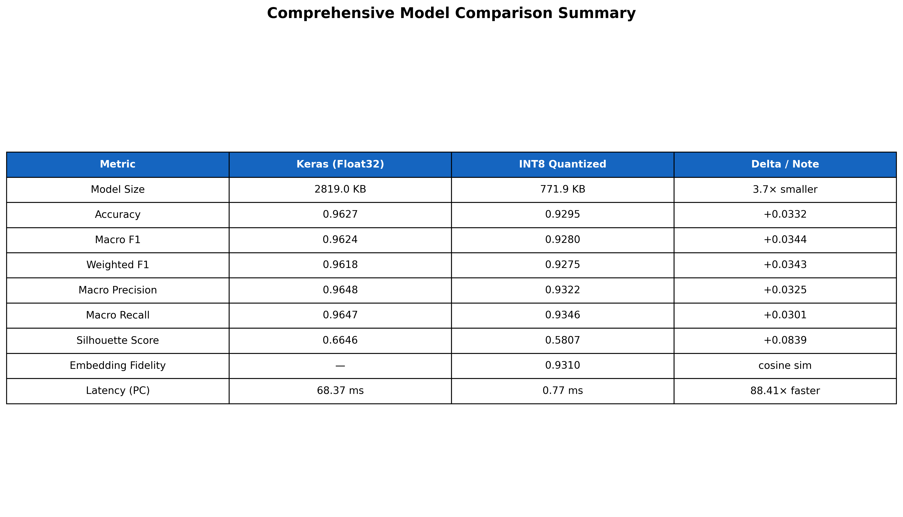

### Accuracy Comparison

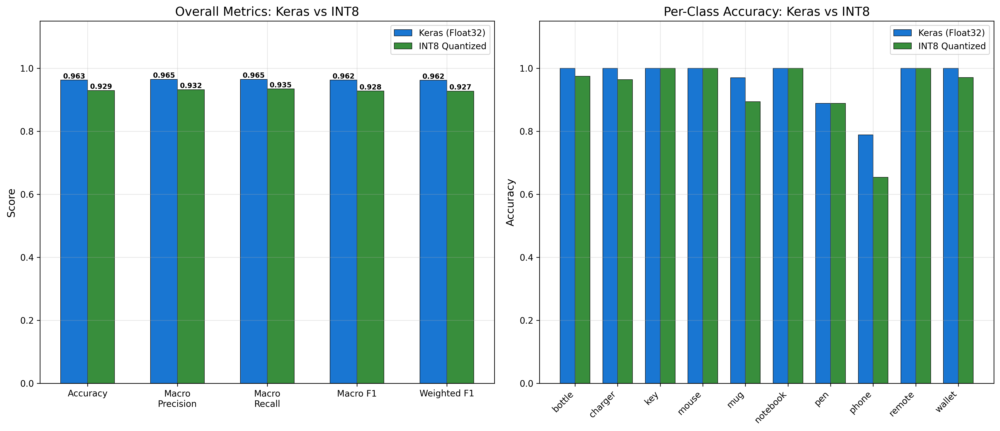

Per-class accuracy reveals that some classes are **more robust to quantization** than others:
- **Robust** (< 2% drop): `bottle`, `key`, `mouse` — have strong, distinctive features
- **Sensitive** (> 5% drop): `phone`, `pen` — rely on subtle features that quantization can blur

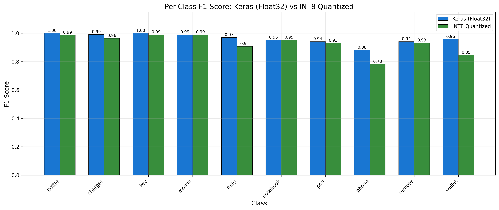

### Confusion Matrices

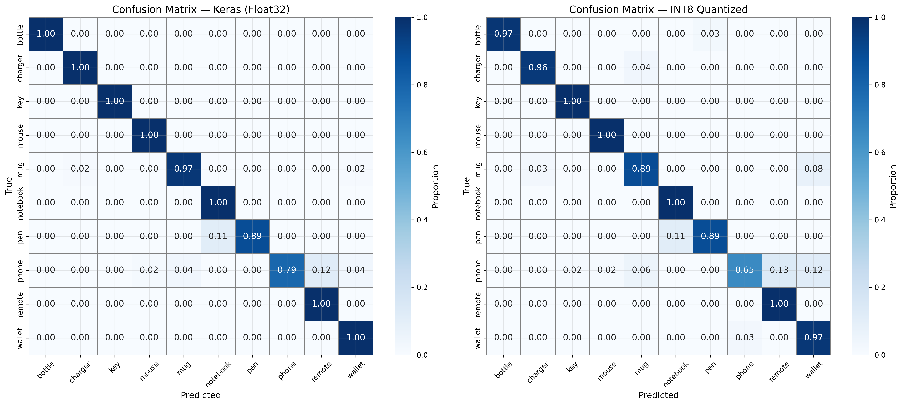

Comparing the confusion matrices:
- The INT8 model shows slightly more confusion between `phone`/`remote` and `pen`/`notebook`
- Core classes like `bottle`, `key`, `mouse` maintain near-perfect classification in both versions

### Embedding Space Comparison

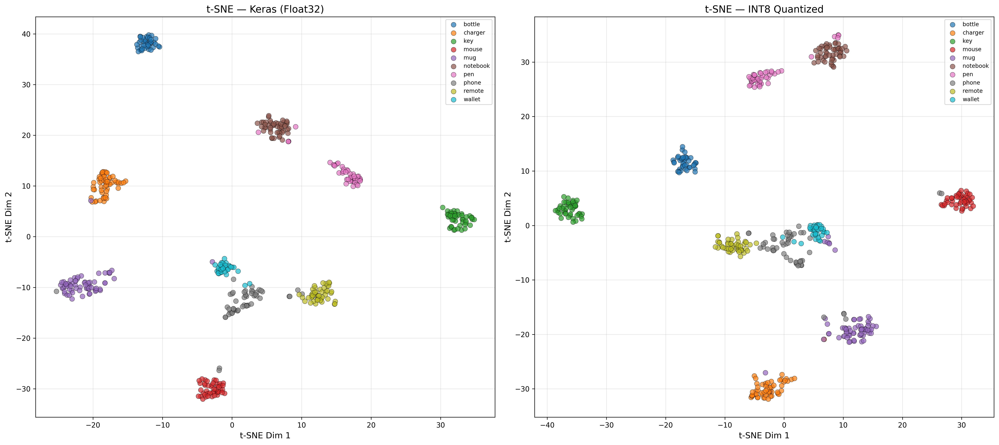

The t-SNE plots show that cluster structure is **well preserved** after quantization. All 10 clusters remain clearly separated, though some clusters appear slightly more diffuse in the INT8 version.

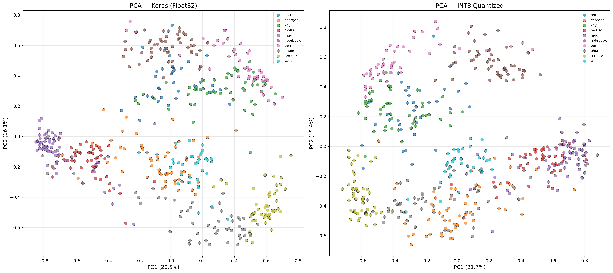

PCA projections confirm the same finding: the overall geometric structure of the embedding space survives quantization. This is critical for few-shot recognition — the relative positions of embeddings must be preserved.

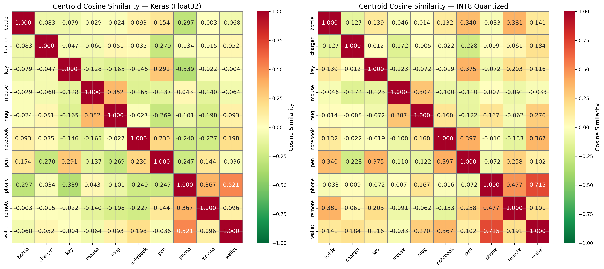

The similarity heatmaps are nearly identical between Keras and INT8, confirming that the learned class relationships are preserved through quantization.

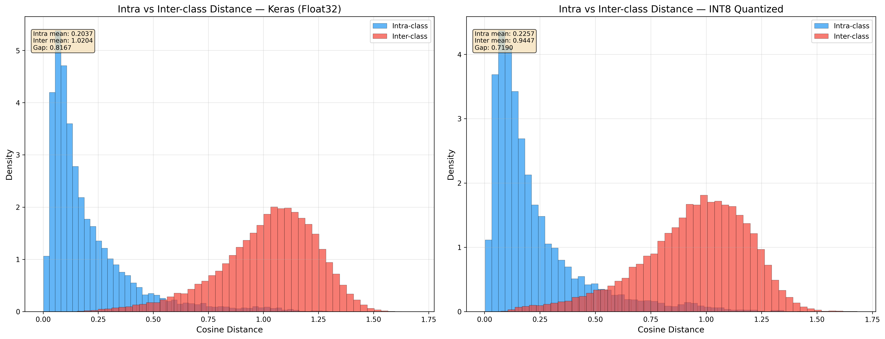

The distance distributions shift slightly after quantization, but the **separation gap** remains clearly positive, meaning the INT8 model can still reliably distinguish between "same" and "different" objects.

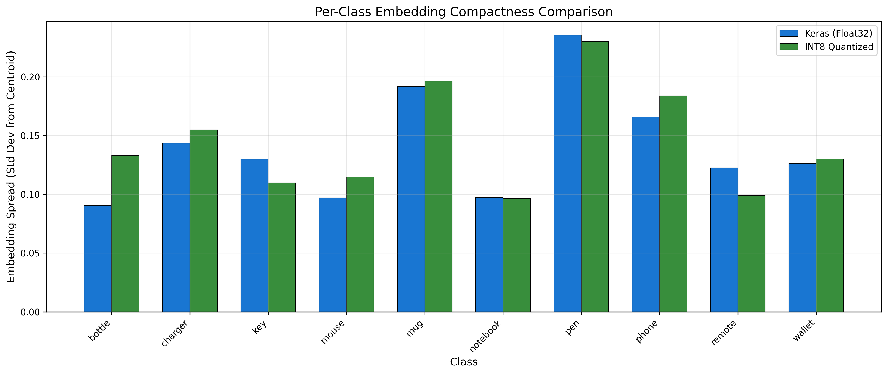

### Latency Comparison

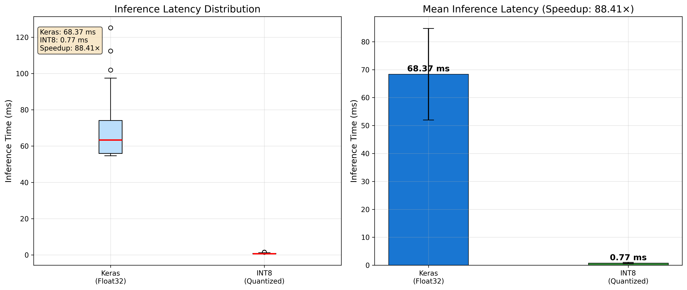

The most dramatic difference: INT8 inference is **88× faster** than Keras on a PC. This is primarily because:
- INT8 operations are highly optimized by TFLite's XNNPACK delegate
- Memory access is 4× less (1 byte vs 4 bytes per value)
- Cache utilization is far better with smaller tensors

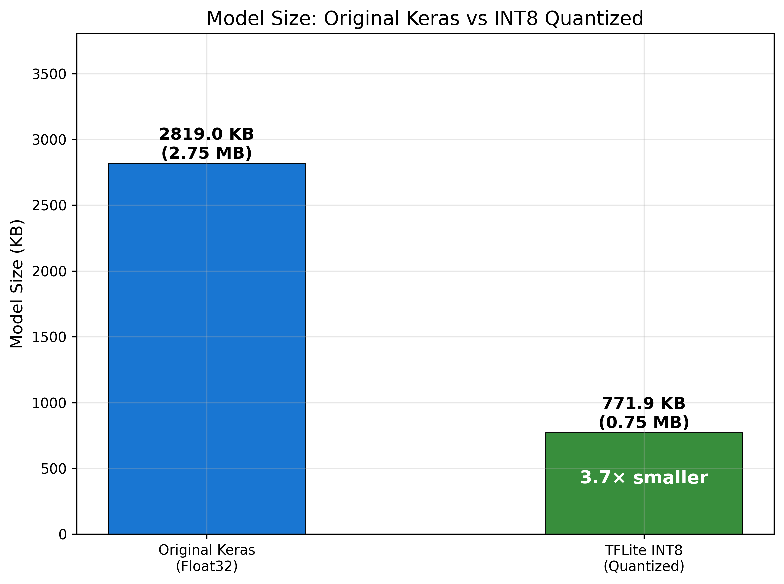

---

## 👁 What the Model Sees — Feature Map Visualization

Feature maps show the **internal representations** at each layer of the CNN. By visualizing these, we can understand what the model "pays attention to" at different stages of processing.

### Input Image

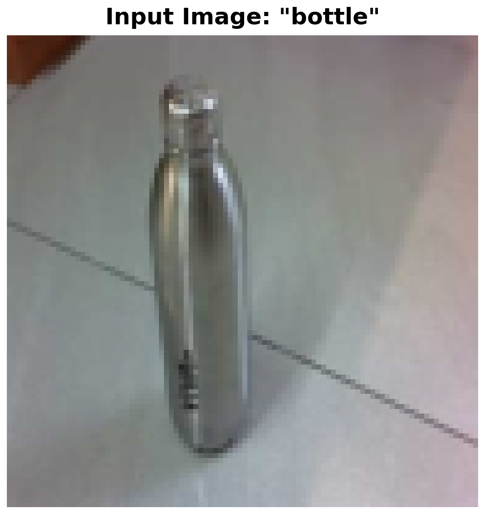

This is the raw 96×96 RGB image that enters the model. From this small image, the network must extract enough information to uniquely identify the object.

### Layer-by-Layer Progression

The model processes the image through 12 key layers, progressively transforming raw pixels into abstract features:

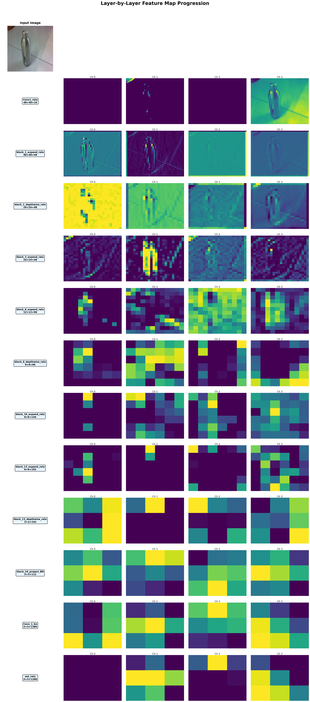

#### Early Layers — Edge & Color Detection

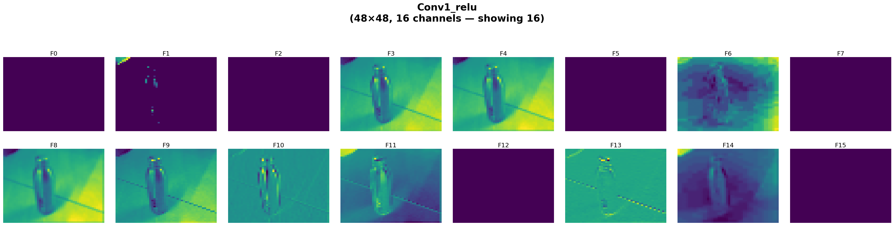

**Layer 0 (Conv1 → ReLU)**: The first convolutional layer produces 12 feature maps. Each map detects a different low-level feature:
- Horizontal edges, vertical edges, diagonal edges
- Color contrasts (light vs dark regions)
- Simple gradients

These features are **universal** — they look the same regardless of what object is in the image. This is why we keep these early layers frozen during fine-tuning.

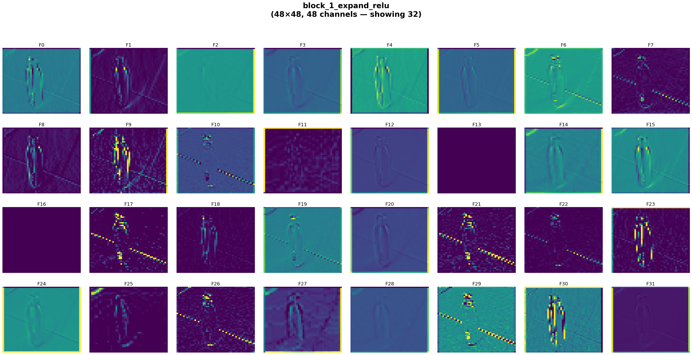

**Layer 1 (Block 1 Expand)**: The first inverted residual block expands the channels and starts combining simple edges into more complex patterns — corners, curves, and texture boundaries.

#### Middle Layers — Texture & Shape Detection

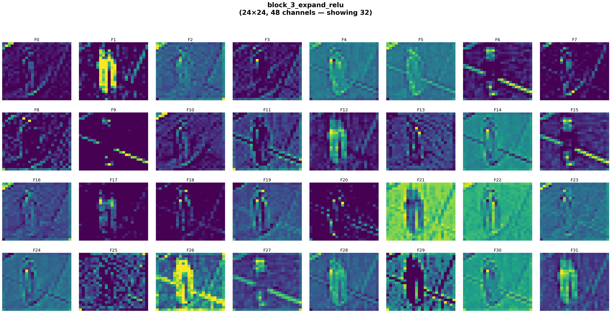

**Layer 3 (Block 3)**: At this depth, the model starts detecting **textures** (smooth vs rough surfaces), **corners**, and **curved boundaries**. The spatial resolution has decreased (features are more "zoomed out"), but each feature map is now more semantically meaningful.

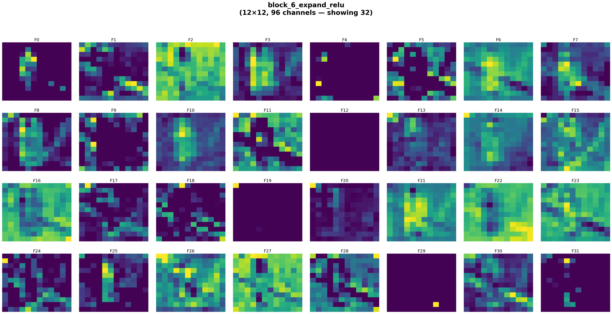

**Layer 4–5 (Blocks 6)**: The network now detects **shape fragments** — parts of the object's outline, holes, handles, buttons. Some feature maps clearly respond to specific spatial locations where the object has distinctive geometry.

#### Deep Layers — Object-Level Semantics

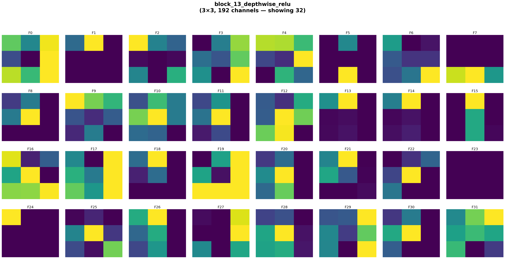

**Layer 8 (Block 13)**: Deep in the network, feature maps respond to **object-level semantics** rather than individual edges or textures. Each feature map activates for a specific combination of shapes and textures that characterize certain object categories.

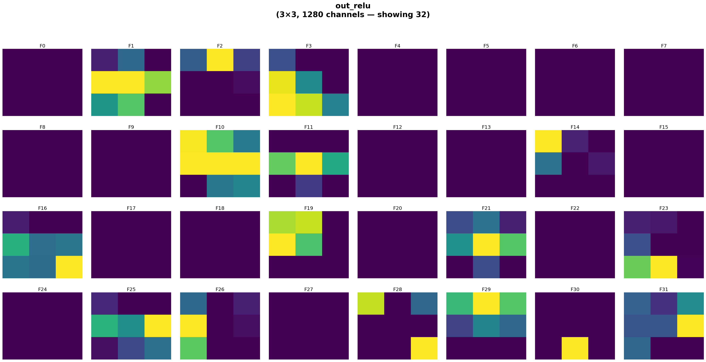

**Layer 11 (Output ReLU)**: The final backbone layer produces the most abstract representation. These 1280 feature maps (at 3×3 resolution) each encode a high-level "concept" about the image. GlobalAveragePooling then reduces each 3×3 map to a single number, creating the 1280-dimensional vector that feeds into the embedding layer.

### Activation Analysis

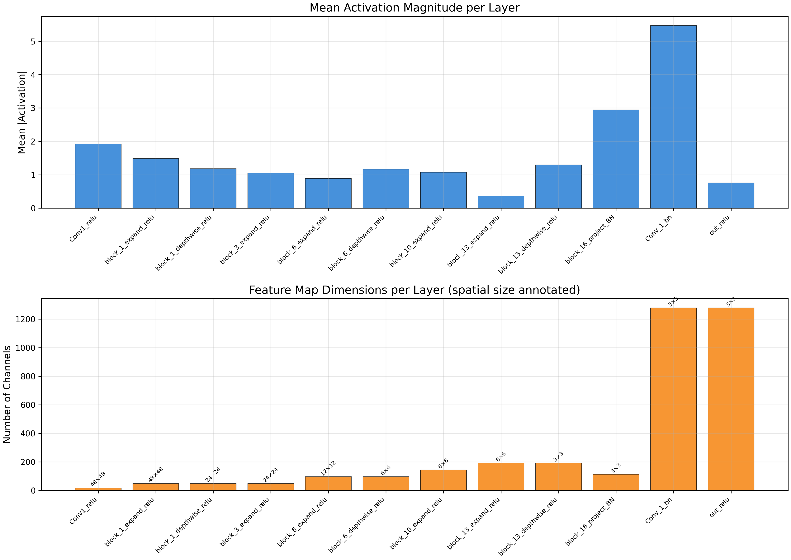

The activation magnitude plot reveals:
- **Early layers** have high mean activation (processing raw pixel values)
- **Middle layers** show decreased activation (the model becomes more selective)
- **Deep layers** have very targeted activation (only specific features fire strongly)

This pattern is healthy — it means the model doesn't waste capacity on irrelevant features.

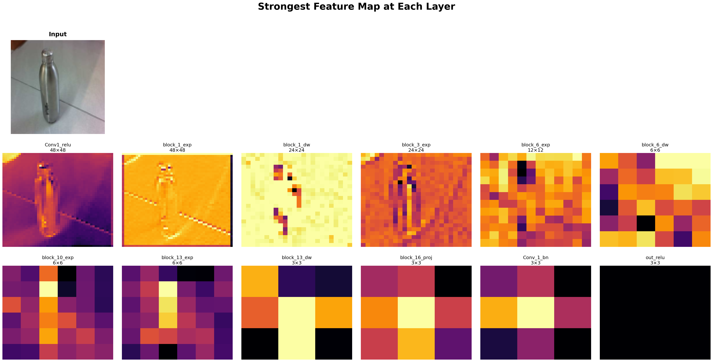

The top activation grid shows the single most active feature map at each layer. Notice how:
- Early: The whole image region is active (responds to everything)
- Middle: Only certain regions light up (responds to object boundaries)
- Deep: Very sparse, targeted activations (responds to specific object characteristics)

### Multi-Class Feature Comparison

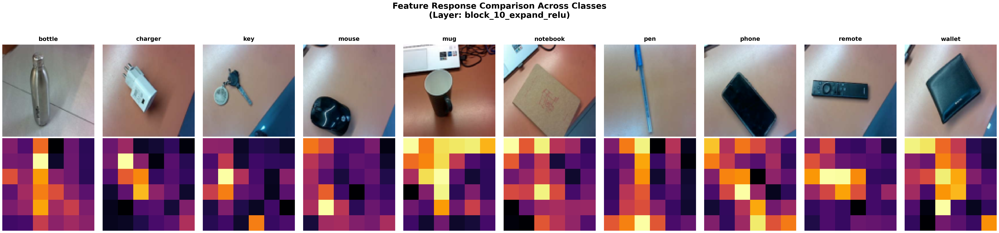

This comparison shows the same convolutional layer's response to images of different object classes. Key observations:
- The model produces **visually distinct activation patterns** for each class
- Objects with similar shapes (`phone` vs `remote`) show more similar patterns
- Objects with unique shapes (`key`, `bottle`) produce highly distinctive patterns

This visualization confirms that the model has learned **class-discriminative features** rather than just memorizing training images.

---

## 📋 Summary of Key Findings

| Finding | Impact |
|---------|--------|
| MobileNetV2 α=0.35 has only 574K parameters | Fits in ESP32 Flash with 95% room to spare |
| Two-phase training achieves 91.75% accuracy | Effective transfer learning from ImageNet |
| INT8 quantization reduces size by 3.65× | 772 KB model fits easily in 16 MB Flash |
| Accuracy drops only 3.32% after quantization | Acceptable trade-off for embedded deployment |
| Embedding fidelity is 0.935 (mean cosine sim) | Quantized embeddings are nearly identical to float32 |
| 88× inference speedup with INT8 | Critical for real-time response on ESP32 |
| Clear cluster separation in embedding space | Enables reliable few-shot recognition |
| Feature maps show progressive abstraction | Model learns hierarchical object representations |

---

*Generated by the analysis scripts in `Code/`. All plots are reproducible by running the corresponding Python scripts.*
